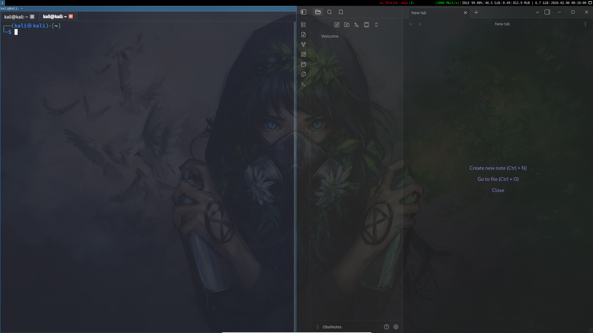

Script to install some tools for pentest activities

### GUI


P.S. For now it requires some manual configuration:
For i3:
Add i3WM Startup:
1) Open `Session and Startup`
2) Select `Application Autostart`
3) Add:
```
Name: i3
Description: Window Manager
Command: i3
Trigger: On login  
```

Disable XFCE Application Startup:
Edit 'Current Session':

```
Program: xfdesktop
Restart Style: Never

Program: xfwm4
Restart Style: Never
```
Xfce panel:
`xfce4-panel --quit`

Credits
1) https://github.com/xct/kali-clean
2) https://www.youtube.com/watch?v=nZTBxJ_gr8w
